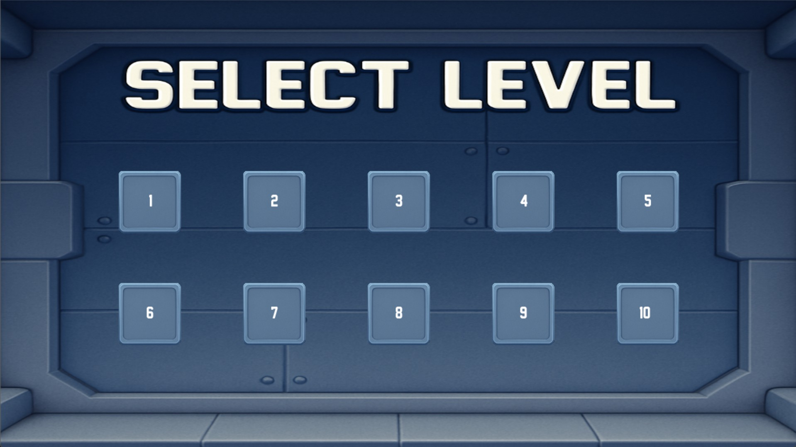
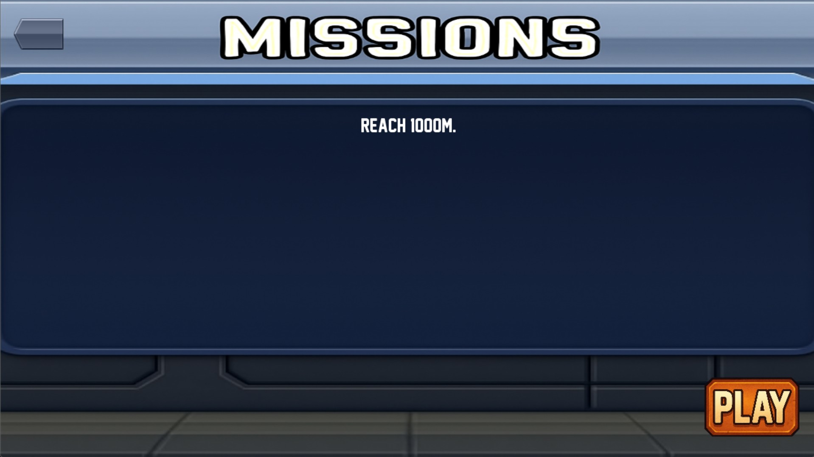
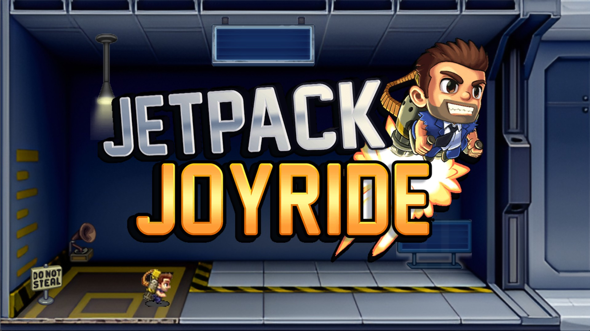
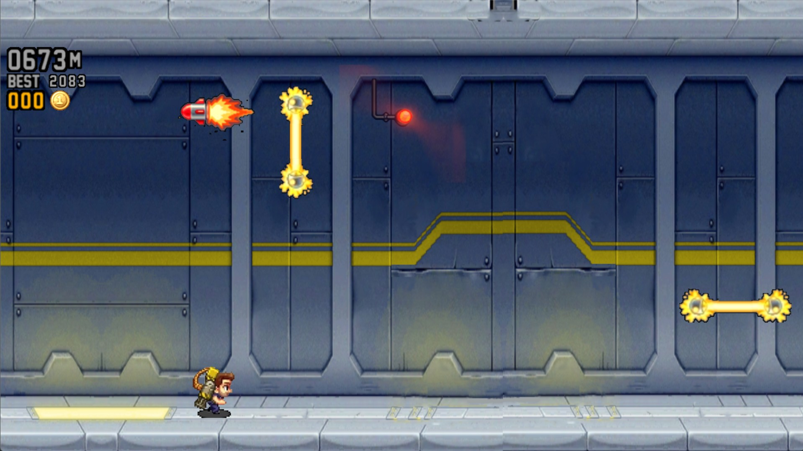
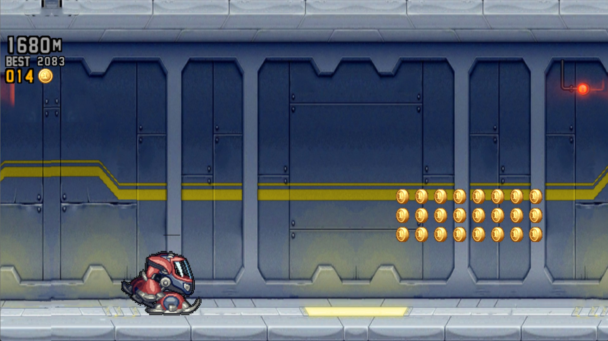
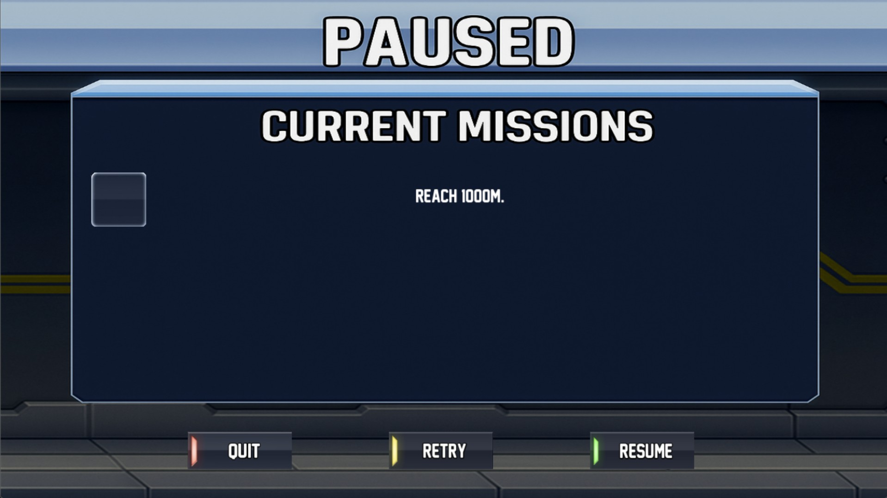
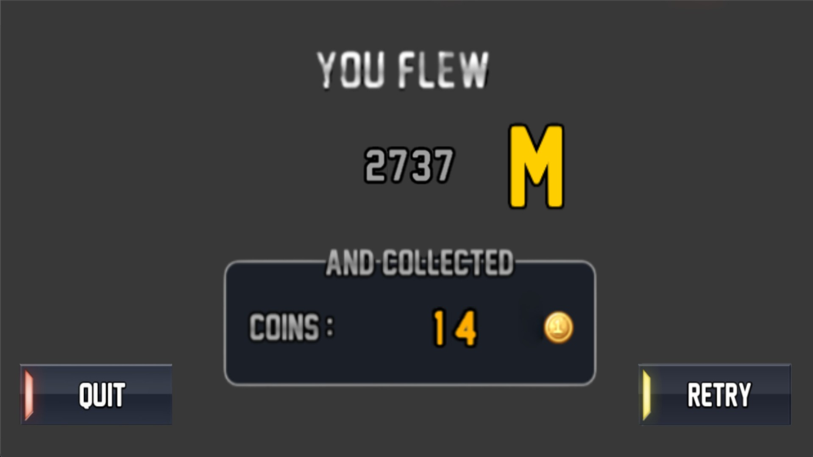
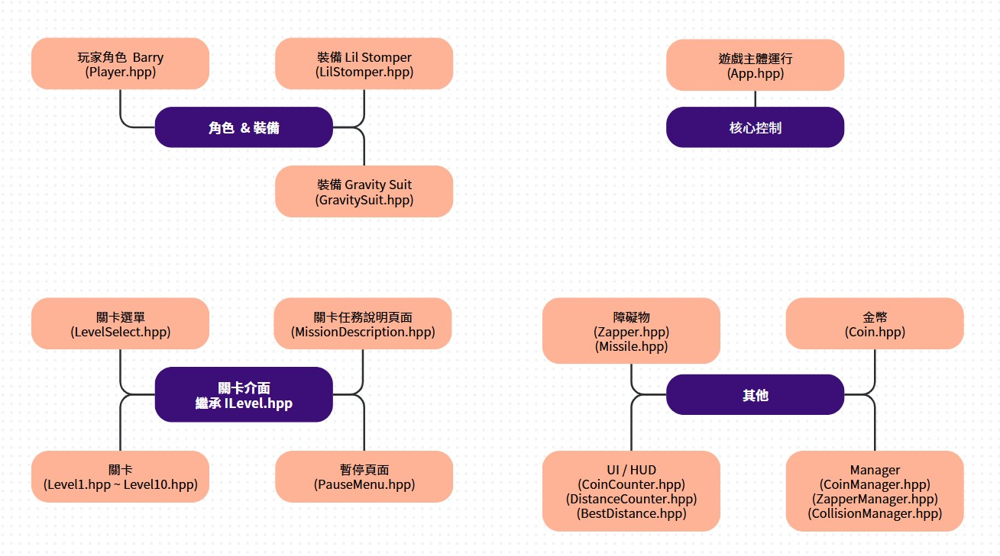

# 2025 OOPL Final Report

## 組別資訊

組別：第四十一組  
組員：  
-111590007 陳偉智                  
-111590062 李其灝   
復刻遊戲：Jetpack Joyride  

## 專案簡介

### 遊戲簡介
Jetpack Joyride 是一款無盡的單機遊戲，玩家須操控角色閃躲障礙物、拾取金幣、穿著裝備等，並盡可能地存活，只要角色碰到障礙物就會死亡。  

## 遊戲介紹

此遊戲可分為五個主要部分：

### 1. 關卡選單

- **說明**：當遊戲啟動後，首先呈現的是關卡選單畫面，供玩家選擇共 **十關** 中任一關卡，進入該關卡後將看到任務說明頁面。

### 2. 任務說明頁面

- **功能說明**：此頁面用以說明玩家所選關卡的目標任務內容。
  - **左上角**：設有 **返回按鈕**，點擊後返回關卡選單。
  - **右下角**：設有 **PLAY 按鈕**，點擊後開始遊戲。

### 3. 主遊戲

- **初始畫面**：進入主遊戲後，玩家首次見到初始遊戲場景。
- **開始流程**：
  - 按下 **Enter** 鍵，使畫面上的遊戲 Logo 開始移動；當 Logo 完全離開畫面後，遊戲正式開始。
- **操作方式**：
  - 使用 **空白鍵** 控制角色移動，閃躲迎面而來的障礙物：
    - **按住**空白鍵：角色向上飛行。
    - **放開**空白鍵：角色下降。
- **障礙物**：
  - 主要障礙物包括 **Zapper** 及 **飛彈**；角色一旦碰到將直接死亡並顯示死亡畫面。
- **其他遊戲物件**：
  - **金幣**
  - **裝備（VEHICLE）**：分為兩種：
    - **Gravity Suit**：穿戴後，按下空白鍵可反轉重力；若玩家在地面則向上移動至天花板，反之則從天花板掉至地面。碰到 **Zapper** 和 **飛彈** 會解除裝備，恢復為一般角色。
    - **Lil Stomper**：穿戴後，移動速度變快，碰到 **Zapper** 可使其消失；但若碰到 **飛彈** 則解除裝備，返回一般角色。
- **介面顯示**：
  - **左上角**同時顯示下列三項資訊：
    - **金幣顯示**：目前拾取的金幣數量。
    - **距離顯示**：玩家累計跑過的距離。
    - **最佳距離顯示**：顯示遊戲中創下的最高距離紀錄。
- **暫停功能**：
  - 遊戲中按下 **P** 鍵將進入暫停畫面。

### 4. 暫停畫面

- **畫面佈局**：
  - **中央**：顯示該關卡玩家須完成的目標敘述。
  - **左側**：目標敘述旁的方格，代表目標達成時會打勾顯示。
- **下方按鈕**：
  - **QUIT**：點擊後退出遊戲返回該關卡的任務說明頁面。
  - **RETRY**：點擊後重新開始新的一輪遊戲。
  - **RESUME**：點擊後繼續遊戲，返回主遊戲畫面。

### 5. 死亡畫面

- **內容展示**：
  - 顯示該局遊戲玩家跑過的距離與拾取的金幣數量。
- **按鈕配置**：
  - **左下角 – QUIT**：返回關卡選單。
  - **右下角 – RETRY**：重新開始當前關卡的遊戲。

---

### 作弊模式

- **鍵盤按鍵設置**：
  - **TAB**：切換無敵模式（開啟/關閉）。開啟後，角色碰到障礙物（如 Zapper、Missile）也不會死亡。
  - **LALT**：按住以加速移動，有助於更快完成遊戲。
  - **1 ~ 0**：按下後切換至對應關卡（0 代表第 10 關）。

### 遊戲規則

- **第一關**  
  - 拾取 **150 個金幣**。

- **第二關**  
  - 跑 **1000M**。

- **第三關**  
  - 觸碰 **10 個紅燈**。

- **第四關**  
  - 累計步行 **500M**。
    - 備註：穿著 Gravity Suit 反重力在天花板上行走同樣視作步行。

- **第五關**  
  - 飛行不落地 **500M**。  
    - 備註：一旦落地則計數重新；穿著 Gravity Suit 反重力在天花板上行走同樣視作落地。

- **第六關**  
  - 在 **800M 至 1500M** 區間內收集 **40 個金幣**。

- **第七關**  
  - 到達 **1000M** 前不拾取任何金幣。

- **第八關**  
  - 收集 **兩個裝備**。

- **第九關**  
  - 穿著 **Gravity Suit** 在天花板上累計步行 **300M**。

- **第十關**  
  - 穿戴裝備並移動 **700M**，過程中不得解除裝備。
    - 備註：一旦解除裝備將重新計算。

### 遊戲畫面
關卡選單  
  

關卡任務說明頁面  
  

遊戲初始畫面  
  

遊戲中畫面  
  

穿著裝備畫面  
  

暫停畫面  
  

死亡畫面  
  

## 程式設計
### 程式架構
  

### 程式技術
由於 Jetpack Joyride 是一個沒有關卡的遊戲，也就不會有關卡選單，所以我們自己建構了關卡選單、任務說明頁面，其他部分就和原始遊戲類似。

**關卡選單**    
用程式動態排版顯示按鈕，讓玩家選擇。計算整體按鈕要置中的左下角起始位置、計算兩排按鈕的總寬度與總高度，再以負值將左下角對齊畫面中心，加上適當的 offset X、Y，把整個區塊在畫面上移動到理想位置。

接著對每一個按鈕，利用按鈕大小 (btnSize) 與間隔 (spacing) 來決定具體位置，並將這個位置存到 Button 的 position 欄位，代表按鈕在世界座標系中的左下角點。

利用 Util::Image 讀取按鈕的 normal 與 pressed 兩張圖，並用 Util::Transform 設定 translation 為 position，scale 則以 btn.size / 原始圖片寬度計算，確保繪製出來的按鈕正好是預期大小。

文字用 Util::Text 事先建立，在繪製時根據文字的 GetSize()，計算水平與垂直的偏移，使其置中於按鈕內。

Util::Input::GetCursorPosition()（回傳以中心為原點的游標座標），再判斷滑鼠按下或放開。當 IsKeyDown 時，檢查游標是否落在某個 Button.Contains 區域，若落在就把該 Button 的 isPressed 標記為 true；當 IsKeyUp 時，如果先前 isPressed 為 true，且放開瞬間游標仍在同一按鈕範圍，就視為點擊成功，設定 chosen 與 chosenLevel。Button.Contains 方法在修正後只比較 position.x ≤ pt.x ≤ position.x + size 與 position.y ≤ pt.y ≤ position.y + size，不再做任何額外偏移補償，就能確保整個按鈕矩形都可點擊。

**任務說明頁面**  
顯示當前關卡對應的任務敘述，以及 Play 與 Return 按鈕。

依照 m_level 索引出對應的任務字串，存到 m_missionStr，然後建立 Util::Text 物件並呼叫 SetText(m_missionStr)，利用 GetSize() 得到文字寬高，計算它在畫面上理想的顯示位置，通常以畫面左側一定距離做水平起點 (textStartX)，垂直則置中或固定在某比例位置。

使用 Util::Image 先載入 Play 與 Return 按鈕的圖檔。在建構函式中，根據原始圖片尺寸乘以縮放比例，計算出按鈕的最終大小；同時考慮 WINDOW_WIDTH、WINDOW_HEIGHT 和 margin，決定按鈕的位置（例如 Play 放右下、Return 放左上），以確保在不同解析度下能正確顯示。

在 Start 階段，將 m_playPressed 與 m_returnPressed 初始化為 false。Update 階段讀取游標位置和滑鼠按鍵狀態，函式 Contains 檢查游標是否在按鈕區域內，根據按下或放開的狀態更新 m_playChosen 與 m_returnChosen。修正後確保按鈕的顯示位置（translation）和點擊檢查中的位置完全一致，避免只有部分區域可點擊。

Render 階段先繪製背景，再渲染文字（僅在文字非空時確保不會出錯），最後根據按鈕狀態選擇正常或按下圖示繪製 Play 與 Return 按鈕。透過設定 transform 的 translation 為 position 且 scale 為 size/originalSize，加上合適的 z-order，使使用者能正確看到視覺反饋。

**碰撞規則**  
使用 AABB 碰撞檢測。

## 結語

### 問題與解決方法
裝備圖示在遊戲中呈現問題：我們將裝備圖示放入遊戲後，發現圖示呈現出來周圍有黑色不明線條出現。仔細放大原始圖片後發現，圖片並不是完整去背，而是帶有一層灰色邊緣區域，所以透過線上編輯圖片將此區域清除，問題就解決了。  

背景音樂和音效的問題：起初我們把所有聲音都當作 BGM 來播放，導致當遊戲中同時有多個音效需要出現時，只會維持最後一個音效，前一個音效就會被覆蓋無法同時播放。後來知道 SFX 是 Sound Effect 後，就將背景音樂和音效分開處理，問題就解決了。  

關卡某些關卡按下暫停時的問題：在 SetText 的時候，發現如果設定 ""，遊戲會當掉然後自動關閉遊戲，顯示 [error] Failed to create text: Text has zero width，所以如果有空字串，至少要 " " 才不會有問題。

### 自評

| 項次 | 項目                   | 完成 |
|------|------------------------|-------|
| 1    | 完成專案權限改為 public |  V  |
| 2    | 具有 debug mode 的功能  |  V  |
| 3    | 解決專案上所有 Memory Leak 的問題  |  V  |
| 4    | 報告中沒有任何錯字，以及沒有任何一項遺漏  |  V  |
| 5    | 報告至少保持基本的美感，人類可讀  |  V  |

### 心得
陳偉智  
由於這是我首次嘗試開發遊戲，初期我花了大量時間琢磨如何還原與呈現遊戲。在整個開發過程中，面臨了不少挑戰，起初主要集中在搜尋與處理素材，而後當我好不容易有了初步成果後，卻又接連遭遇了許多 Bug，迫使我與組員不斷地逐一修正，隨著時間推移，整體狀況才逐漸明朗。雖然整個過程僅持續了短短十七週，但這段經歷讓我從零開始逐步實現了一些成果，儘管最終成果與原始遊戲仍有些差距，但這段過程讓我清楚認識到開發遊戲的困難，讓我有了一次開發遊戲經驗。

李其灝   
這次開發游戲，讓我深入體會到遊戲開發的完整流程。從專案架構規劃、類別設計，到實作玩家控制、關卡機制、碰撞判斷和 UI 介面，每個環節都需要細心思考和不斷調整。在實作過程中，遇到過不少困難，例如碰撞偵測的邏輯、遊戲狀態的切換、資源管理等問題，但透過查資料和不斷嘗試，最終都一一克服。完成專案後，不僅提升了我的程式能力，也讓我對遊戲開發有了更深的認識。

### 貢獻比例

陳偉智 50%  
- 分析遊戲、蒐集遊戲需要素材
- 關卡選單、任務說明頁面
- 畫面移動、背景持續、畫面速度增加
- Zapper、Coin 製作
- 碰撞規則
- 玩家死亡畫面
- 收集錢幣顯示、最佳距離顯示
- 暫停功能
- 關卡製作
- 修復 bug

李其灝 50% 
- 分析遊戲、蒐集遊戲需要素材
- 遊戲初始場景、物件
- 玩家移動控制
- 裝備、飛彈、飛彈來臨提示
- 碰撞規則
- 距離計算顯示
- debug mode
- 修復 bug
 